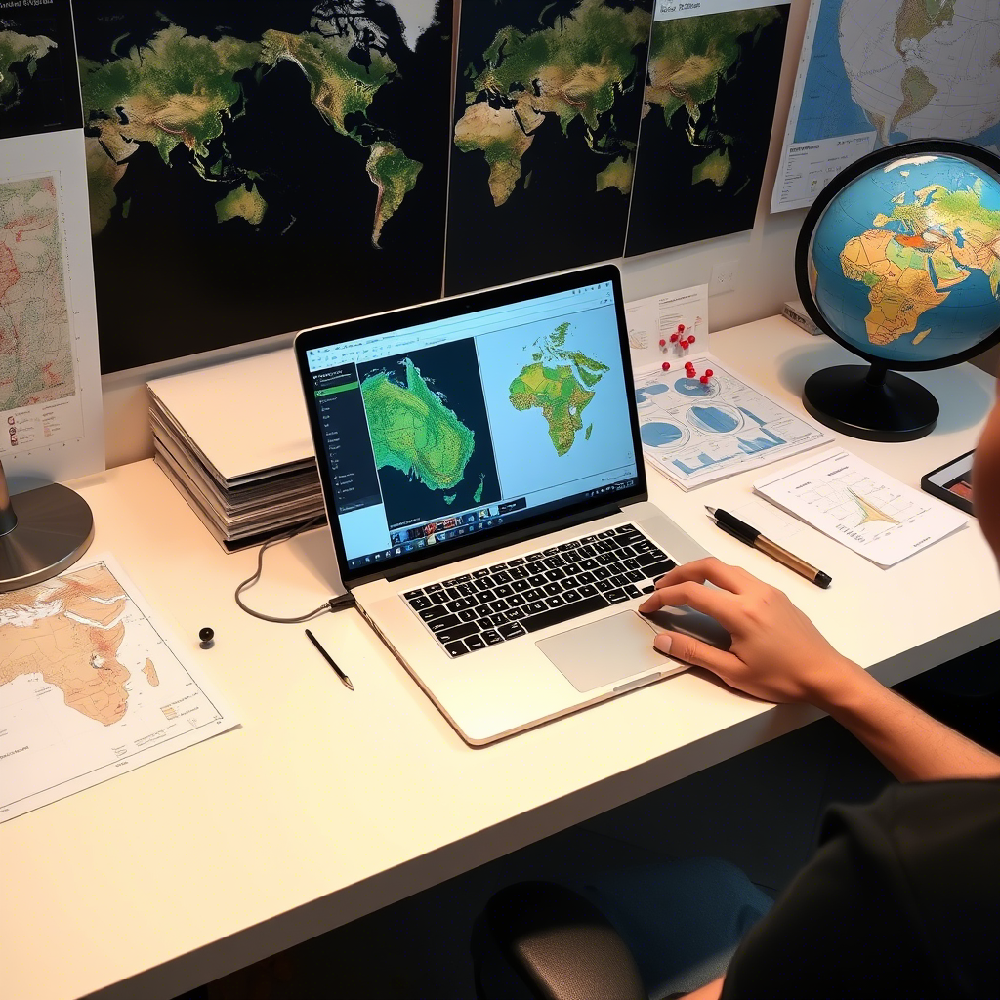

# Skills & Expertise

<!-- Load Google Fonts: Caveat -->
<link href="https://fonts.googleapis.com/css2?family=Caveat&display=swap" rel="stylesheet">

  <!-- Left Column: Centered Picture -->
  

    
  

  <!-- Right Column: Bullet Points -->
  

    <h3 style="margin-top: 0;"><strong>Research Skills</strong></h3>
    <ul style="line-height: 1.6;">
      <li>Quantitative Microbial Risk Assessment (QMRA)</li>
      <li>Qualitative Research</li>
      <li>Quantitative Research</li>
      <li>Community-based Participatory Research</li>
      <li>Intervention Research</li>
      <li>Implementation Research</li>
      <li>Systematic Review</li>
      <li>Geospatial Analysis</li>
      <li>Development of surveys in digital platforms like REDcap, KOBOcollect, and ODK, Google form</li>
    </ul>
  

*****
<!-- Load Google Fonts: Caveat -->
<link href="https://fonts.googleapis.com/css2?family=Caveat&display=swap" rel="stylesheet">

  <!-- Left Column: Bullet Points -->
  

    <h3 style="margin-top: 0;"><strong>Leadership Skills</strong></h3>
    <ul style="line-height: 1.8;">
      <li>Generating independent research Ideas</li>
      <li>Leading Multi-disciplinary Research Team</li>
      <li>Collaborative work with National  & International donors</li>
      <li>Problem solving & conflict mitigation</li>
      <li>Train Field Research team</li>
      <li>Train Field Research team</li>
    </ul>
  

  <!-- Right Column: Centered Picture -->
  

    
  

*******
# Computational skills

<!-- Load Caveat font for handwritten style -->
<link href="https://fonts.googleapis.com/css2?family=Caveat&display=swap" rel="stylesheet">

  <!-- Qualitative -->
  

     
    <strong>Qualitative Data </strong> 
    <strong> Management & Analysis</strong> 
    Dedoose, NVIVO 
  

  <!-- Quantitative -->
  

     
    <strong>Quantitative  Data </strong> 
    <strong>Management & Analysis</strong> 
    R, STATA, SPSS, Excel
  

  <!-- Geospatial -->
  

     
    <strong>Geospetial Data</strong> 
    <strong>Management & Analysis</strong> 
    ArcGIS, QGIS, Google Earth Pro
  

  <!-- Reporting -->
  

     
    <strong>Reporting & Budgeting</strong> 
    <strong>Sub-award management</strong> 
    Word, PowerPoint, Excel
  

  <!-- UA Logo -->
  

    
  

  <!-- Contact Info -->
  

    
<strong>Contact:</strong> 
    Mehedi Hasan 
    Email: <a href="mailto:mehedihasan@arizona.edu">mehedihasan@arizona.edu</a> 
    Phone: +1 (520) 269 5013

  

  <!-- Social Media -->
  

    
<strong>Connect:</strong>

    
    
    
        
        
  
 
  <strong><I>"I'm always open to meaningful research collaborations—feel free to reach out anytime!"<I></strong>

